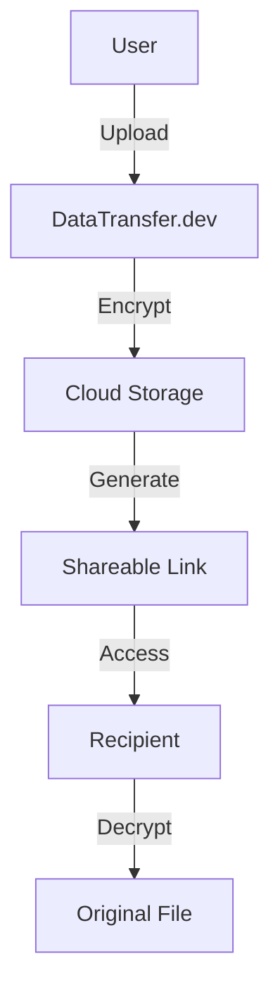

# DataTransfer.dev
DataTransfer.dev - ফাইনাল ইমপ্লিমেন্টেশন প্ল্যান**   **একটি সম্পূর্ণ ফাইল-বাই-ফাইল ডেভেলপমেন্ট গাইড**
# DataTransfer.dev - Secure File Sharing Platform


## 📌 Overview

DataTransfer.dev is an ultra-secure platform for transferring files between devices with military-grade encryption and self-destructing links. Our technology ensures your data remains private and disappears after use.

```bash
npm install datatransfer-cli
```

## ✨ Key Features

- 🔒 End-to-end encryption (AES-256 + RSA)
- ⚡ Lightning-fast transfers (WebRTC + TCP acceleration)
- 🕒 Self-destructing links (24h expiration)
- 📱 Cross-platform compatibility
- 🤖 AI-powered file organization

## 🚀 Quick Start

### Prerequisites
- Node.js 16+
- MongoDB 4.4+
- Redis 6+

### Installation
1. Clone the repository:
```bash
git clone https://github.com/yourusername/datatransfer.git
cd datatransfer
```

2. Install dependencies:
```bash
npm install
```

3. Set up environment variables:
```bash
cp .env.example .env
# Edit .env with your configurations
```

4. Run the development server:
```bash
npm run dev
```

## 🧩 Project Structure

```
.
├── client/              # Frontend React application
├── server/              # Backend Node.js server
├── scripts/             # Deployment and utility scripts
├── .github/             # CI/CD workflows
└── docs/                # Project documentation
```

## 🌐 API Documentation

Our REST API follows the OpenAPI 3.0 specification. Explore the API:

[](https://api.datatransfer.dev/docs)

Sample API Request:
```javascript
fetch('https://api.datatransfer.dev/v1/transfer', {
  method: 'POST',
  headers: {
    'Content-Type': 'application/json',
    'Authorization': 'Bearer YOUR_TOKEN'
  },
  body: JSON.stringify({
    file: 'base64_encoded_data',
    expiresIn: '24h'
  })
});
```

## 🛡️ Security Measures

We implement multiple layers of security:

1. **Data Encryption**
   - Files encrypted at rest and in transit
   - Per-transfer encryption keys

2. **Access Control**
   - JWT authentication
   - Rate limiting
   - IP whitelisting

3. **Privacy Protection**
   - No file metadata retention
   - Automatic file deletion
   - Regular security audits

## 🤝 Contributing

We welcome contributions! Please follow these steps:

1. Fork the repository
2. Create your feature branch (`git checkout -b feature/AmazingFeature`)
3. Commit your changes (`git commit -m 'Add some AmazingFeature'`)
4. Push to the branch (`git push origin feature/AmazingFeature`)
5. Open a Pull Request

## 📄 License

This project is licensed under the AGPL-3.0 License - see the [LICENSE](LICENSE) file for details.

## 📧 Contact

For security issues or enterprise inquiries, contact us at:

- Email: security@datatransfer.dev
- Twitter: [@DataTransferDev](https://twitter.com/DataTransferDev)
- GitHub: [github.com/datatransfer-dev](https://github.com/datatransfer-dev)

---



**Note:** This diagram shows the basic data flow through our system. All steps are secured with multiple layers of encryption.
